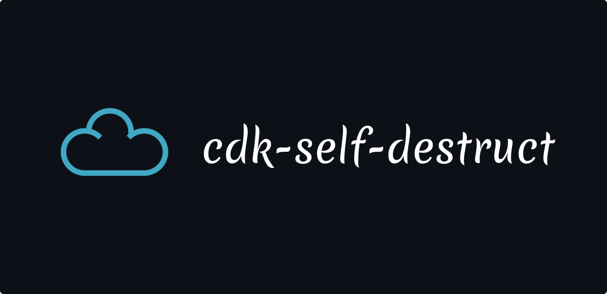

<p align="center">
 
</p>

[](https://badge.fury.io/js/cdk-self-destruct)


A solid tool for destroying temporary CDK environments, which are commonly used in automated testing. With its scheduling feature for stack destruction, you can easily set a time and date or generate a url for the automatic removal of unnecessary stacks, freeing up resources and optimizing the testing workflow. It also removes resources that are impeding stack deletion, such as non-empty S3 buckets.

Inspired by [cdk-time-bomb](https://github.com/jmb12686/cdk-time-bomb), rewritten with aws-cdk v2 and the new [AWS EventBridge Scheduler](https://aws.amazon.com/de/blogs/compute/introducing-amazon-eventbridge-scheduler).

## Installing

**requires aws-cdk: "^2.51.0"**

```bash
npm install cdk-self-destruct

# or

yarn add cdk-self-destruct
```

## Usage

Include it at the end of your stack. Behind the scenes it uses [CDK Aspects](https://docs.aws.amazon.com/cdk/v2/guide/aspects.html) to capture all resources automatically.

```ts
import { type StackProps, Stack, Duration } from 'aws-cdk-lib'
import { type Construct } from 'constructs'
import { SelfDestruct } from 'cdk-self-destruct'

export class AwesomeStack extends Stack {
  public constructor(
    scope: Construct,
    id: string,
    props: StackProps
  ) {
    super(scope, id, props)

    new SelfDestruct(this, 'SelfDestruct', {
      defaultBehavior: {
        destoryAllResources: true,
        purgeResourceDependencies: true,
      },
      trigger: {
        scheduled: {
          afterDuration: Duration.days(1),
          enabled: true,
        },
      },
    })
  }
}
```

## Features

1. Set `RemovalPolicy` for all resources inside a stack
2. Destroy resource dependencies that are blocking the stack deletion
   - Purge S3 buckets before deletion
   - Stop all running state-machine executions
   - *more coming soon*
3. Schedule stack deletions after a given duration or at a given timestamp
4. Create a [Lambda function URL](https://docs.aws.amazon.com/lambda/latest/dg/lambda-urls.html) to delete the stack easily from the pipeline

## Options

### Select per individual resource

A list of all available options can be found [here](https://docs.aws.amazon.com/AWSCloudFormation/latest/UserGuide/aws-template-resource-type-ref.html)

```ts
new SelfDestruct(this, 'SelfDestruct', {
  // ...
  byResource: {
    resourcesToDestroy: ['AWS::S3::Bucket'],
    resourcesToRetain: ['AWS::DynamoDB::Table'],
  },
})
```

### Schedule for a given Date

Stack deletion may be scheduled for a given UTC timestamp.

```ts
new SelfDestruct(this, 'SelfDestruct', {
  // ...
  trigger: {
    scheduled: {
      atTimestamp: new Date('2023-01-01T00:00:00Z').getTime(),
      enabled: true,
    },
  },
})
```

### Invoke via a lambda function url

Function urls allow to start the stack deletion manually via an http request.
Authentication is available via IAM or via unauthenticated requests.

```ts
new SelfDestruct(this, 'SelfDestruct', {
  // ...
  trigger: {
    addFunctionUrl: {
      cloudformationOutput: {
        description: 'URL to invoke the self-destruct function',
        exportName: 'SelfDestructUrl',
      },
      enabled: true,
      options: {
        // Allow unauthenticated requests
        authType: cdk.aws_lambda.FunctionUrlAuthType.NONE,
      },
    },
  },
})
```
